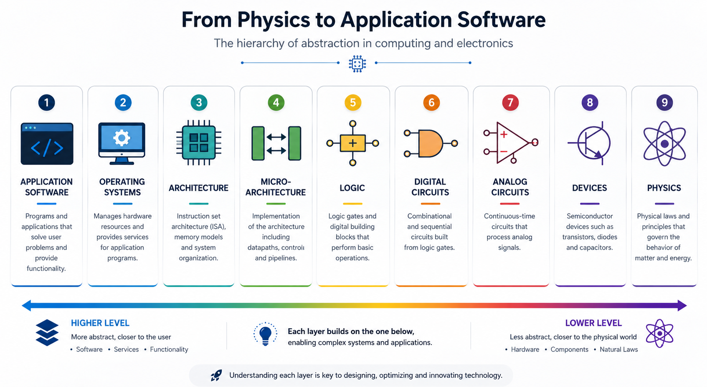

<h1 align="center">Hi, I'm Edgar Gutierrez (DevGutic) 👋</h1>
<h3 align="center">Electronic Engineer | Robotics | AI | Embedded Systems | Control | Digital Design</h3>

<h1 align="center">DISEÑO DE HARDWARE</h1>

# Introducción al Diseño Digital

<table>
<tr>
<td>

Los microprocesadores constituyen una de las tecnologías más influyentes de la era moderna. Su evolución ha permitido el desarrollo de dispositivos con capacidades de procesamiento cada vez mayores, haciendo posible desde computadores personales de alto rendimiento hasta sistemas embebidos presentes en automóviles, equipos médicos, teléfonos inteligentes y una amplia variedad de aplicaciones industriales. Asimismo, han impulsado el crecimiento de la industria de los semiconductores y han transformado profundamente la manera en que las personas se comunican, trabajan, investigan y resuelven problemas tecnológicos.

El propósito de este curso es proporcionar los fundamentos necesarios para comprender el funcionamiento interno de un microprocesador y desarrollar las competencias requeridas para diseñar uno desde sus elementos más básicos. A lo largo del proceso de aprendizaje, el estudiante adquirirá conocimientos aplicables al desarrollo de diversos sistemas digitales, fortaleciendo su capacidad para analizar, diseñar e implementar soluciones basadas en hardware digital.

Para aprovechar el contenido del curso, es recomendable contar con conocimientos básicos de electricidad, nociones de programación y motivación por entender la arquitectura y operación de los computadores. El recorrido inicia con el estudio de la lógica digital, donde se analizan las compuertas lógicas y la representación binaria de la información. Posteriormente, se abordan circuitos de mayor complejidad, como unidades aritméticas, registros y memorias, que constituyen los bloques funcionales de un sistema digital.

Una vez comprendidos estos componentes, se introduce el lenguaje ensamblador como medio para interactuar directamente con la arquitectura del procesador y comprender la ejecución de instrucciones a bajo nivel. Finalmente, todos estos conceptos convergen en el diseño e implementación de un microprocesador capaz de ejecutar programas, integrando hardware y software en un sistema funcional.

Aunque los sistemas digitales se fundamentan en principios relativamente sencillos basados en dos estados lógicos, el verdadero desafío consiste en organizar estos elementos de manera estructurada para construir sistemas cada vez más sofisticados. Por ello, además del aprendizaje técnico, este curso enfatiza el desarrollo de metodologías de diseño que permitan abordar la complejidad mediante la modularidad, la jerarquización y la integración progresiva de componentes, competencias esenciales para el diseño de sistemas electrónicos modernos.

</td>
</tr>
</table>

# Como gestionar la complejidad en el Diseño de Hardware

La capacidad para enfrentar sistemas complejos de forma estructurada es una de las competencias fundamentales en la formación de un ingeniero. En el diseño de sistemas digitales modernos intervienen enormes cantidades de transistores interconectados, lo que hace inviable analizar el funcionamiento de cada uno por separado. Por esta razón, el desarrollo de microprocesadores se basa en principios de abstracción, modularidad y diseño jerárquico, que permiten comprender, construir y verificar sistemas de gran escala de manera ordenada y eficiente.

# Abstracción

La abstracción es uno de los principios fundamentales de la ingeniería y la informática, ya que permite gestionar la complejidad de los sistemas dividiéndolos en niveles organizados donde cada capa oculta los detalles internos de la anterior y expone únicamente las funcionalidades necesarias para la siguiente. Gracias a este enfoque, es posible diseñar, comprender y desarrollar sistemas extremadamente complejos, como microprocesadores, sistemas embebidos o computadores completos, sin necesidad de conocer simultáneamente todos sus componentes físicos y funcionales. En el contexto del diseño de hardware y los sistemas digitales, la abstracción establece una jerarquía que parte de las leyes fundamentales de la física, continúa con los dispositivos electrónicos, los circuitos analógicos y digitales, la lógica, la microarquitectura y la arquitectura del procesador, hasta llegar al sistema operativo y al software de aplicación. Cada nivel se construye sobre el anterior, aprovechando sus servicios y ocultando su complejidad, lo que facilita el desarrollo modular, la reutilización de componentes, la verificación de diseños y la innovación tecnológica. Sin este modelo jerárquico de abstracción, el diseño de los sistemas electrónicos modernos, que integran miles de millones de transistores y millones de líneas de código, sería prácticamente imposible.

## 1. ⚛️ Physics (Física)

La base de toda la jerarquía es la Física, ya que ninguna tecnología electrónica podría existir sin las leyes fundamentales que describen el comportamiento de la materia y la energía. En este nivel se estudian disciplinas como el electromagnetismo, la mecánica cuántica y la física del estado sólido, las cuales explican fenómenos como el movimiento de los electrones, la conducción eléctrica y las propiedades de los materiales semiconductores. Aunque todavía no existen computadores ni circuitos electrónicos, este nivel proporciona los principios científicos que hacen posible el funcionamiento de todos los sistemas digitales modernos.

## 2. 🔬 Devices (Dispositivos)

A partir de los principios físicos es posible fabricar los dispositivos electrónicos que constituyen los bloques fundamentales del hardware. En este nivel aparecen componentes como transistores, diodos, resistencias y capacitores, siendo el transistor MOSFET el dispositivo más importante de la electrónica digital moderna. Aquí se estudian aspectos relacionados con la fabricación del silicio, el dopado de materiales, la tecnología CMOS y las características eléctricas de cada dispositivo. Aunque todavía no existen puertas lógicas ni circuitos complejos, estos dispositivos representan la materia prima con la que posteriormente se construirán todos los sistemas digitales.

## 3. 📈 Analog Circuits (Circuitos Analógicos)

Los dispositivos electrónicos comienzan a interconectarse para formar circuitos analógicos, cuya función consiste en procesar señales continuas que pueden tomar cualquier valor dentro de un determinado rango. En este nivel se diseñan amplificadores, filtros, reguladores, osciladores y sistemas de acondicionamiento de señales. La electrónica analógica resulta esencial porque el mundo físico es inherentemente analógico: sensores como micrófonos, cámaras, termómetros o acelerómetros generan señales continuas que deben ser acondicionadas antes de ser procesadas digitalmente. De igual manera, muchos actuadores requieren nuevamente señales analógicas para interactuar con el entorno.

## 4. 🔌 Digital Circuits (Circuitos Digitales)

El siguiente nivel introduce el concepto de electrónica digital, donde la información deja de representarse mediante valores continuos y pasa a expresarse mediante niveles lógicos, normalmente asociados con los valores 0 y 1. Los transistores comienzan a organizarse para construir puertas lógicas, registros, multiplexores, decodificadores, memorias y otros bloques digitales fundamentales. Esta representación binaria hace que los sistemas sean considerablemente más robustos frente al ruido eléctrico y facilita el diseño de circuitos extremadamente complejos. En este nivel se implementa físicamente el hardware encargado de procesar información digital.

## 5. 🧠 Logic (Lógica)

Aunque suele confundirse con los circuitos digitales, la lógica digital representa un nivel de abstracción superior. Mientras que los circuitos describen cómo se implementa físicamente una función mediante puertas electrónicas, la lógica se concentra en qué función matemática realiza el sistema. Aquí aparecen conceptos como el Álgebra de Boole, las tablas de verdad, la simplificación de funciones mediante mapas de Karnaugh, la lógica combinacional, la lógica secuencial y las máquinas de estados finitos. En otras palabras, este nivel describe el comportamiento funcional del sistema sin preocuparse todavía por su implementación física.

## 6. ⚙️ Microarchitecture (Microarquitectura)

Una vez definidas las funciones lógicas, estas comienzan a integrarse para construir subsistemas cada vez más complejos. La microarquitectura describe la organización interna de un procesador y especifica cómo interactúan bloques funcionales como la ALU, los bancos de registros, las unidades de control, las memorias caché, los pipelines y los buses de comunicación. Este nivel responde a la pregunta de cómo implementar físicamente una determinada arquitectura de procesador, optimizando aspectos como el rendimiento, el consumo energético y el paralelismo. Es precisamente en esta capa donde se desarrolla gran parte del diseño moderno sobre FPGA y ASIC.

## 7. 🖥️ Architecture (Arquitectura)

La arquitectura del computador representa la interfaz visible entre el hardware y el software. En este nivel se define el Instruction Set Architecture (ISA), es decir, el conjunto de instrucciones que un procesador es capaz de ejecutar, junto con la organización de registros, los modos de direccionamiento, el modelo de memoria y los mecanismos de interrupción. Arquitecturas como RISC-V, ARM, MIPS o x86 especifican las capacidades funcionales del procesador sin describir cómo están implementadas internamente. Gracias a esta separación, diferentes procesadores pueden ejecutar exactamente el mismo software aun cuando posean microarquitecturas completamente distintas.

## 8. 💻 Operating Systems (Sistema Operativo)

Sobre la arquitectura del procesador se construye el Sistema Operativo, cuya función principal consiste en administrar y coordinar todos los recursos del computador. Este software controla la memoria, los procesos, los dispositivos de entrada y salida, el sistema de archivos, la seguridad y la comunicación entre aplicaciones. Además, proporciona una capa de abstracción que permite a los programas utilizar el hardware sin necesidad de conocer sus detalles internos. Sistemas como Linux, Windows, Android o FreeBSD simplifican enormemente el desarrollo de aplicaciones al encargarse de gestionar de manera eficiente todos los recursos físicos disponibles.

## 9. 🚀 Application Software (Software de Aplicación)

En la parte superior de la jerarquía se encuentra el software de aplicación, que representa el nivel más cercano al usuario final. Aquí se desarrollan programas capaces de resolver problemas específicos, como herramientas de diseño asistido por computador, navegadores web, simuladores, aplicaciones científicas, videojuegos o entornos de desarrollo. El usuario interactúa únicamente con las funcionalidades que ofrecen estas aplicaciones, sin necesidad de comprender la enorme complejidad existente en las capas inferiores. Todo el conocimiento relacionado con la física, los dispositivos electrónicos, los circuitos, la lógica, la arquitectura del procesador y el sistema operativo permanece oculto gracias al principio de abstracción jerárquica, permitiendo construir sistemas de enorme complejidad de forma organizada, modular y escalable.

---

*La principal enseñanza de esta jerarquía es que cada nivel abstrae la complejidad del nivel inferior y proporciona servicios al nivel superior. Gracias a este enfoque, un ingeniero puede diseñar un procesador sin preocuparse directamente por la física cuántica de los electrones, mientras que un desarrollador de software puede crear aplicaciones sin conocer la estructura interna del hardware. Esta organización por niveles constituye uno de los principios fundamentales de la Ingeniería Electrónica, la Arquitectura de Computadores y el Diseño Digital, ya que permite desarrollar sistemas modernos con miles de millones de transistores de manera estructurada, reutilizable y eficiente.*

--- 

